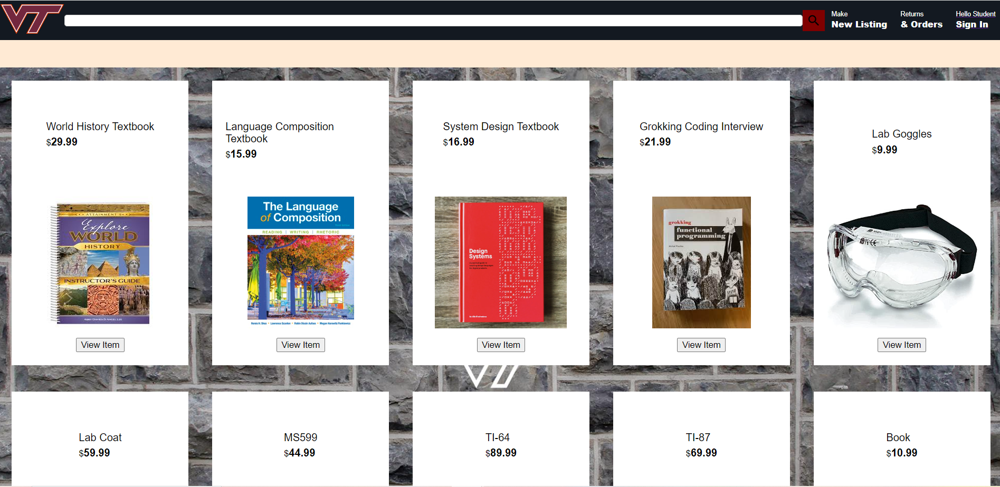
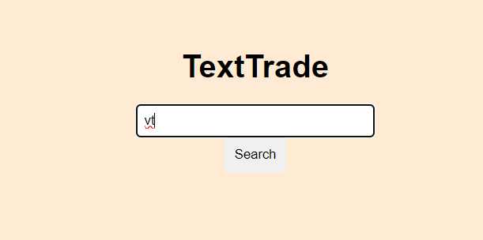
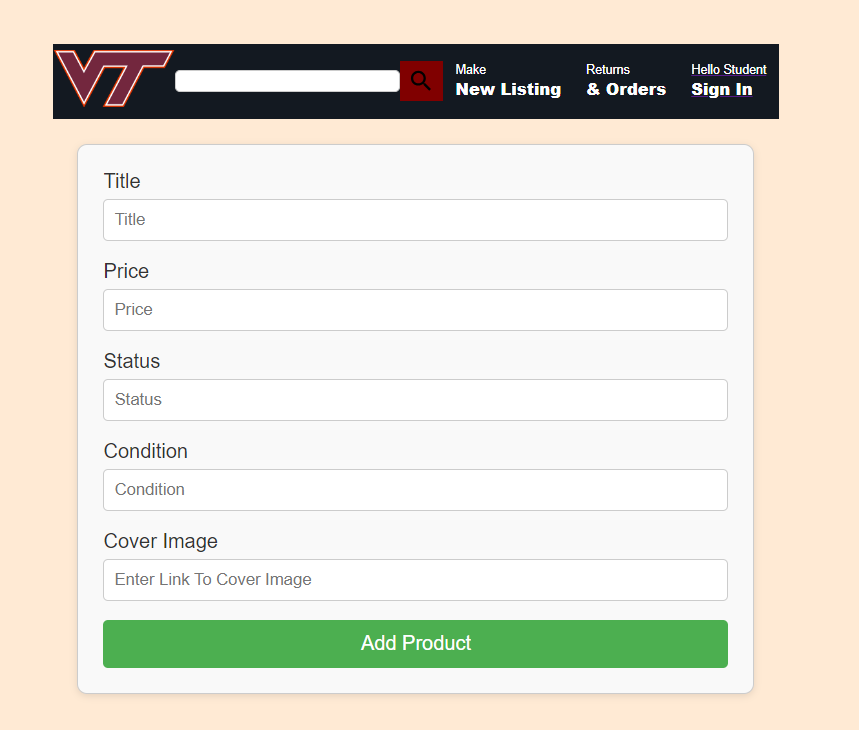
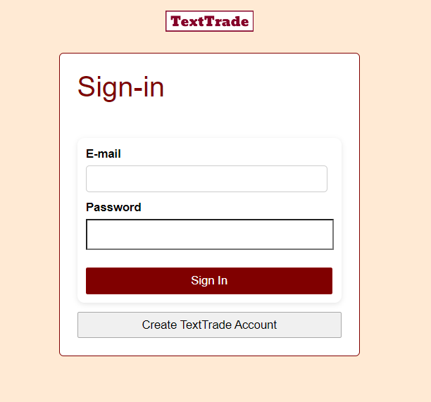

# How to run 
Before running, make sure that you have node.js installed. If you have it/downloaded it, run `npm install` in the frontend and backend directories. Once this is done, run `npm start` in the backend directory to connect to the port, needed for email authentication. Then, run `npm start` in the frontend directory to start up the application, connecting it to the MongoDB. If for some reason there is an error saying a package doesn't exist, then just run `npm install <package name>`. 

# IMPORTANT NOTE (please read) 
Go to the Mongo website and add your IP into the project after requesting access from me. To add your IP, once you log into MongoDB and access our project, you should see a prompt that asks you to add your IP address. Otherwise, click on "Network Acess", which should be found on the left of your screen, under "Security". You should be able to add your IP address here. This will allow you to connect to the database from your machine. If you don't do this, then none of the product information will appear on our website. 

# Using the site 
This section is to just give a brief overview on the pages of the site.

This is the homepage. Entering "vt" or "virginia tech" into the search bar will take you to the main page which is what you have seen above.

This is the listing page. You can make a new listing here.

This is the login/registration page. Creating a new account will send you an email verification code to make that account. 

